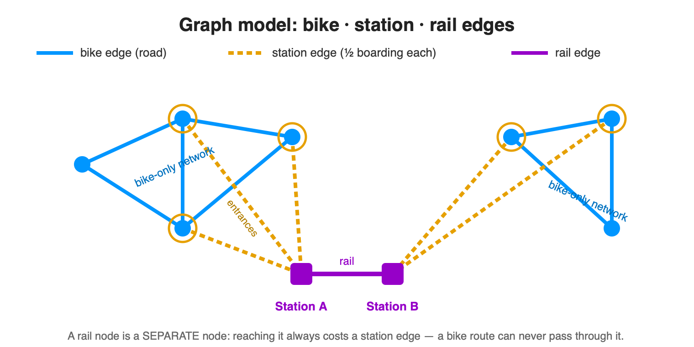

# bike-route-optimizer

Plan a bike route that avoids climbing, bad surfaces, and busy roads — and optionally hops on a train where it saves a big hill. Optimised for the Germany + Austria + Switzerland (DACH) region.

## Setup

```bash
python3 -m venv .venv                 # once
source .venv/bin/activate             # every new shell (macOS / Linux)
pip install -r requirements.txt
```

## Run the web app (3D map)

```bash
source .venv/bin/activate
streamlit run app_webmap.py
```

Open the Local URL it prints (default http://localhost:8501). Type a start and end place, press **📍 Set start & end** to mark them on the 3D map, tune the five preference sliders, then press **🧭 Compute route**. The route is drawn as a coloured ribbon floating above the terrain (blue bike legs, purple train legs); below the map you get the route stats, three composition donuts (surface / road / mode), a copyable Google Maps link, and Download GPX / Download PNG buttons.

## Run the CLI

```bash
source .venv/bin/activate
python bike_route.py "Freudenstadt, Germany" "Pforzheim, Germany"
```

Add `--extra_km_per_uphill_100m 100` (or any other preference flag) to bias the route; run with `-v` for progress logging.

## The five preferences

Each preference is expressed in the same intuitive unit: **how many extra kilometres would you happily pedal to avoid one unit of the bad thing.** `0` = ignore it, higher = go further out of your way to avoid it. Each cell below mirrors the slider/`--help` tooltip verbatim.

| Flag | What it means (`0` = … ; high = …) |
|---|---|
| `--extra_km_per_uphill_100m` | Extra km you'd ride to avoid every 100 m of climbing (0 = ignore hills; high = long detours to stay flat). |
| `--extra_km_per_unpaved_km` | Extra km you'd ride to avoid 1 km of unpaved surface (0 = don't mind gravel; high = detour far to stay paved). |
| `--extra_km_per_main_road_km` | Extra km you'd ride to avoid 1 km on a busy main road (0 = don't mind them; high = detour far to avoid main roads). |
| `--extra_km_per_rail_km` | Extra km you'd bike to avoid 1 km carried by train (0 = train distance is free; high = avoid long train legs). |
| `--extra_km_per_boarding` | Extra km you'd bike to avoid boarding a train once (0 = board freely; high = avoid catching trains). |

## The physics & mathematics

Routing happens on a graph: junctions are nodes, the roads between them are edges. Every edge carries its true length in metres, the height difference between its ends, its surface, its road class, and — for train links — a rail marker. The planner turns each edge into a single "felt cost" in metres, then finds the path from start to finish with the least total felt cost. Because every part of the cost is a real distance plus non-negative penalties, the cheapest possible edge is just its raw length, which keeps the search provably optimal.

For a **bike** edge the felt cost adds up like this, where every term is already in metres so they combine cleanly:

$$
\text{felt cost} = \text{length} + \frac{\text{climb m}}{100}\cdot p_{\text{uphill}}\cdot 1000 + \text{length km}\cdot p_{\text{unpaved}}\cdot 1000 \cdot \text{tier} + \text{length km}_{\text{main}}\cdot p_{\text{mainroad}}\cdot 1000
$$

Climb counts only going up (downhill adds nothing, so the same street is cheaper downhill than up). Surface and road class are handled as tier allowlists, where the **tier number is a literal multiplier** on the per-km penalty:

- **Tier 0** is the free, preferred kind — smooth paved surfaces and quiet bike-friendly ways.
- **Tier 1** rides but adds the penalty once — loose/gravel surfaces and busy main roads.
- **Tier 2** (surface only) adds *double* the penalty — natural/rough-but-rideable ground (dirt, grass, …).
- Anything **not listed** (genuinely impassable surfaces like mud/sand/rock, motor-only highways) is **excluded** from the graph at build time, so no route can use it.
- A **missing/untagged** value is assumed tier 1 (pessimistic — kept but penalised).

For a list-valued tag the **worst (highest) tier wins**. The exact class-to-tier mapping lives in the config, not here, so it never drifts from the code.

A **train** edge (station to station) is priced completely differently — a train doesn't care about hills, surface, or traffic, so it only pays for distance travelled:

$$
\text{felt cost} = \text{length} + \text{length km}\cdot p_{\text{rail}}\cdot 1000
$$

The boarding cost lives on the **station edges** instead (see the graph-model section below): each station edge charges half of $p_{\text{boarding}}$, so getting on plus getting off sums to exactly one boarding.

Once the path is chosen, its **ride time** comes from a speed that falls with the slope: roughly 25 km/h on flat good tarmac, and slower on gravel. Speed is dropping linearly toward walking pace on a steep 12 % climb. Downhill and flat hold the top speed. A train leg instead moves at a fixed 80 km/h, and each station edge adds half of a flat 30-minute wait, so getting on plus getting off sums to one full 30-minute wait per train trip. Distance and climb come straight from the real road geometry, so the reported kilometres, minutes, and metres-of-ascent all agree with the drawn track.

## The graph model: bike, station, and rail edges



Every node is **exactly one** kind — a cycling node or a rail-station node, never both. A normal bike route therefore only ever traverses **bike edges** (blue) between bike nodes. Each station is a **separate rail node**; the up-to-10 nearest bike nodes inside a 200 m radius are declared its **entrances**, joined to it by **station edges** (orange, each costing straight-line distance + ½ the boarding charge). Stations are linked to their neighbours along the track by **rail edges** (purple). Because a station is its own node reachable only across a station edge, a bike route can never cut *through* a station (in one entrance, out another) for free — passing through costs a full boarding, which naturally deters it. Board + alight together pay exactly one boarding, even if exchanging at a in between rail node into antoher train.

## Preprocessing, publishing, and auto-download

The routing graph is built once offline. The build bakes in elevation, so first download the full Europe-wide EuroDEM once (from [mapsforeurope.org](https://www.mapsforeurope.org/datasets/euro-dem)) and crop it to DACH. Then **one** script builds the graph in four phases: download the raw OpenStreetMap extracts (`.osm.pbf`, one per region); build each region **in isolation** (dropping unrideable surfaces, merging junctions within ~25 m, baking in DEM elevation, adding train links), freeing memory between regions so peak RAM stays bounded; combine them into one connected network; and validate cross-region connectivity. Each region is a standalone artifact flagged complete, so a re-run skips finished regions and resumes. Output is compact tiled map-data files; final dir must be empty first.

```bash
# one-time: crop the full EuroDEM to DACH (writes data/region_dem.tif, the build's fixed input)
python scripts/crop_dem_to_dach.py --input ~/Downloads/euro-dem-tif/data/eurodem/eurodem.tif

# quick check on one small region, clipped to a test bbox (Schwarzwald, ~5 min).
python scripts/build_dach_graph.py --only karlsruhe-regbez --bbox 8.30 48.40 8.80 48.95

# full DACH (~5 GB, hours; output dir must be empty). Detached + no-sleep, logs to build_dach.log:
nohup caffeinate -s .venv/bin/python -u scripts/build_dach_graph.py > build_dach.log 2>&1 &

# publish the finished graph to Hugging Face (separate step; log in once when prompted)
python scripts/upload_graph_to_huggingface.py
```

The app looks for the graph locally first; if missing it downloads it once from Hugging Face and caches it, so later runs are instant and offline.

Everything build-related lives in the repo's gitignored `data/` folder: the DEM (`data/region_dem.tif`), region extracts (`data/dach_build/pbf/`), per-region artifacts (`data/dach_build/dach_graph_per_region/`), and the final tiled artifact (`data/dach_graph/`). `upload_graph_to_huggingface.py` pushes `data/dach_graph/` to the dataset repo in `GraphConfig.HF_REPO_ID`.
